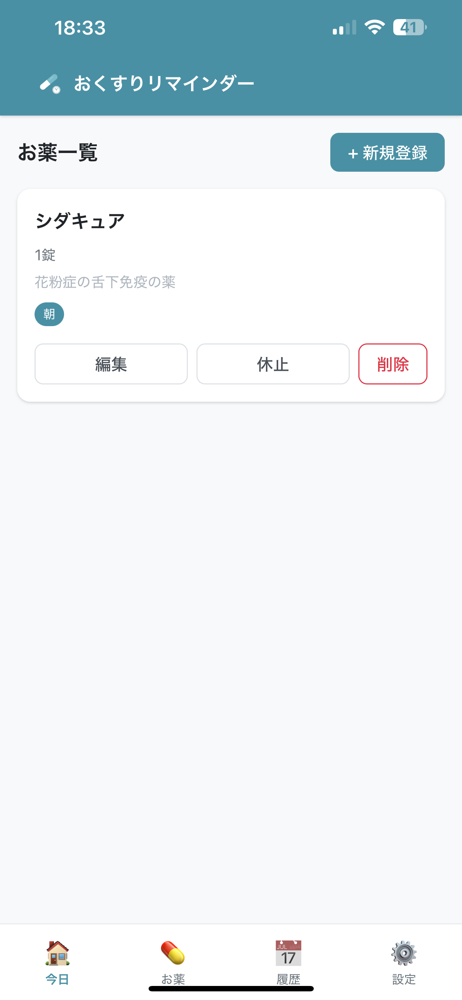
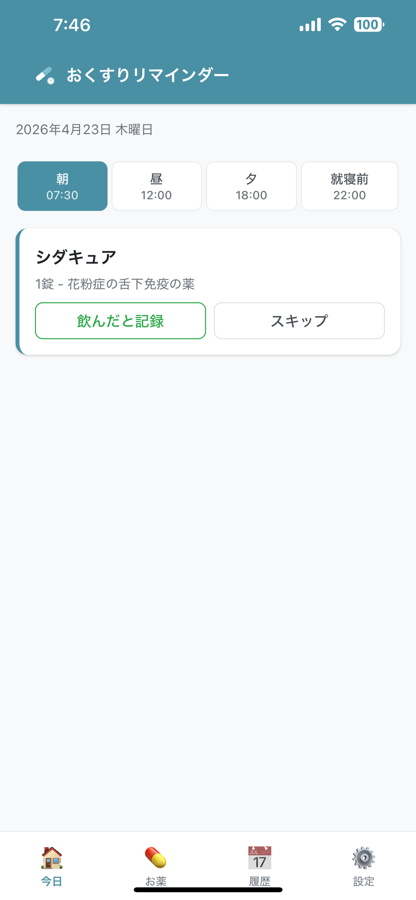
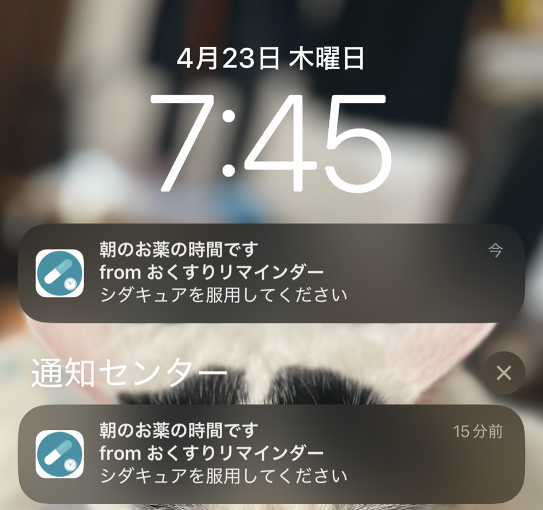
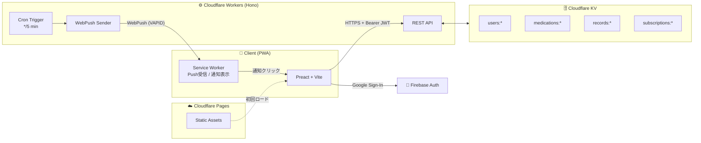

<p align="center">
  
</p>

<h1 align="center">おくすりリマインダー</h1>

<p align="center">
  <em>A simple, family-friendly PWA for daily medication reminders.</em><br/>
  毎日のお薬の飲み忘れを防ぐ、家族で使える Web Push 対応 PWA。
</p>

<p align="center">
  <a href="https://my-medicine-reminder.pages.dev"></a>
  <a href="./LICENSE"></a>
  <a href="https://github.com/MisonoTakezo/my-medicine-reminder/releases"></a>
  
  
  
</p>

---

## 📸 スクリーンショット

<p align="center">
  
  
  
  
  
</p>

## 📖 目次

- [✨ 機能](#-機能)
- [🧱 技術スタック](#-技術スタック)
- [🏛 アーキテクチャ](#-アーキテクチャ)
- [🚀 セットアップ](#-セットアップ)
- [🌐 デプロイ](#-デプロイ)
- [📱 iPhone での利用](#-iphone-での利用)
- [🔌 API エンドポイント](#-api-エンドポイント)
- [🗂 ディレクトリ構成](#-ディレクトリ構成)
- [🔖 バージョニング](#-バージョニング)
- [📝 ライセンス](#-ライセンス)

## ✨ 機能

- 💊 **複数のお薬を登録・管理** — 有効/無効を切り替えて一時停止も可能
- ⏰ **朝・昼・夕・就寝前の 4 タイミング** — 各タイミングの時刻はユーザーごとに設定
- 🔔 **Web Push でリマインド** — 定時通知。未服用なら設定間隔で再通知
- 🧘 **記録したら通知は自動で静かに** — 服用記録と同時に残留通知を閉じる
- 📅 **カレンダー履歴** — 月単位で taken / skipped / 未記録を一覧
- 👪 **家族で独立した記録** — Firebase Auth (Google) で各自の服用履歴を完全分離
- 📱 **iOS / Android ホーム画面へ追加** — PWA 対応、オフラインでも表示可能
- 🗾 **JST 固定** — サーバー・クライアント双方で日付境界を `Asia/Tokyo` に統一

## 🧱 技術スタック

| レイヤー | 採用技術 |
| --- | --- |
| フロントエンド | Preact + Vite + TypeScript |
| PWA / 通知表示 | Service Worker + Workbox |
| バックエンド API | Cloudflare Workers + [Hono](https://hono.dev/) |
| データストア | Cloudflare KV |
| 認証 | Firebase Authentication (Google) |
| プッシュ通知 | Web Push (VAPID) ※自前実装 |
| スケジューラー | Cloudflare Cron Triggers（5 分間隔） |
| ホスティング | Cloudflare Pages |

## 🏛 アーキテクチャ



## 🚀 セットアップ

### 前提条件

- Node.js 18 以上
- Cloudflare アカウント
- Firebase プロジェクト

### 1. Firebase の設定

1. [Firebase Console](https://console.firebase.google.com/) でプロジェクトを作成
2. Authentication を有効化し、Google 認証を設定
3. プロジェクト設定から Web アプリを追加し、設定値を取得

### 2. Cloudflare の設定

1. [Cloudflare Dashboard](https://dash.cloudflare.com/) にログイン
2. Workers & Pages → KV で新しい Namespace を作成
3. `workers/wrangler.toml` の KV ID を更新

### 3. VAPID 鍵の生成

```bash
cd workers
npx web-push generate-vapid-keys
```

### 4. 環境変数の設定

```bash
# フロントエンド
cd frontend
cp .env.example .env   # Firebase の設定値を入力

# Workers
cd ../workers
cp .dev.vars.example .dev.vars   # VAPID・Firebase 設定値を入力
```

本番環境では Cloudflare Dashboard → Workers → Settings → Variables で設定します。

### 5. 依存関係のインストール

```bash
cd frontend && npm install
cd ../workers && npm install
```

### 6. 開発サーバーの起動

```bash
# ターミナル 1: Workers
cd workers && npm run dev

# ターミナル 2: Frontend
cd frontend && npm run dev
```

ブラウザで <http://localhost:5173> を開く。

## 🌐 デプロイ

### Workers

```bash
cd workers
npm run deploy
```

### フロントエンド (Cloudflare Pages)

1. GitHub リポジトリに push
2. Cloudflare Pages でリポジトリを接続
3. ビルド設定:
   - ビルドコマンド: `cd frontend && npm install && npm run build`
   - ビルド出力ディレクトリ: `frontend/dist`
4. 環境変数 (`VITE_FIREBASE_*` 等) を Pages の設定で登録

## 📱 iPhone での利用

1. Safari でアプリにアクセス
2. 共有ボタン → 「ホーム画面に追加」
3. アプリを起動して Google でログイン
4. 設定画面で「通知を有効化」

> ℹ️ Web Push には iOS 16.4 以降が必要です。

## 🔌 API エンドポイント

| メソッド | パス | 説明 |
| --- | --- | --- |
| `POST` | `/api/auth/verify` | Firebase トークン検証 |
| `GET` | `/api/medications` | 薬一覧取得 |
| `POST` | `/api/medications` | 薬登録 |
| `PUT` | `/api/medications/:id` | 薬更新 |
| `DELETE` | `/api/medications/:id` | 薬削除 |
| `GET` | `/api/settings` | ユーザー設定取得 |
| `PUT` | `/api/settings` | ユーザー設定更新 |
| `GET` | `/api/records/:date` | 日別記録取得 |
| `GET` | `/api/records?from=&to=` | 期間指定記録取得 |
| `POST` | `/api/records` | 服用記録登録 |
| `GET` | `/api/push/vapid-key` | VAPID 公開鍵取得 |
| `POST` | `/api/push/subscribe` | WebPush 購読登録 |
| `DELETE` | `/api/push/subscribe` | WebPush 購読解除 |
| `POST` | `/api/push/test` | テスト通知送信 |
| `POST` | `/api/admin/migrate-records-tz` | UTC ずれ記録を JST キーへ移行（`?dryRun=true` 対応） |

すべて `Authorization: Bearer <Firebase ID Token>` が必須です。

## 🗂 ディレクトリ構成

```
my-medicine-reminder/
├── frontend/                       # Preact + Vite (PWA)
│   ├── public/                     # アイコン、manifest
│   └── src/
│       ├── components/             # UI コンポーネント
│       ├── hooks/                  # カスタムフック
│       ├── pages/                  # 画面
│       ├── services/               # API / Firebase クライアント
│       ├── styles/                 # グローバル CSS
│       ├── types/                  # TypeScript 型定義
│       ├── utils/                  # 日付ユーティリティなど
│       ├── App.tsx
│       ├── main.tsx
│       └── sw.ts                   # Service Worker 本体
├── workers/                        # Cloudflare Workers (Hono)
│   └── src/
│       ├── routes/                 # /api/* のルート
│       ├── services/               # scheduler などのビジネスロジック
│       ├── utils/                  # auth / kv / date / webpush
│       ├── index.ts                # エントリポイント
│       └── types.ts
├── docs/
│   ├── images/                     # README 用スクリーンショット
│   └── implementation_plan.md      # 設計メモ
├── LICENSE
└── README.md
```

## 🔖 バージョニング

[Semantic Versioning](https://semver.org/lang/ja/) に従います。リリースは [GitHub Releases](https://github.com/MisonoTakezo/my-medicine-reminder/releases) に公開します。

- `vMAJOR.MINOR.PATCH` の形式
- 破壊的変更 → MAJOR、機能追加 → MINOR、修正のみ → PATCH

## 📝 ライセンス

[MIT License](./LICENSE) の下で公開しています。
