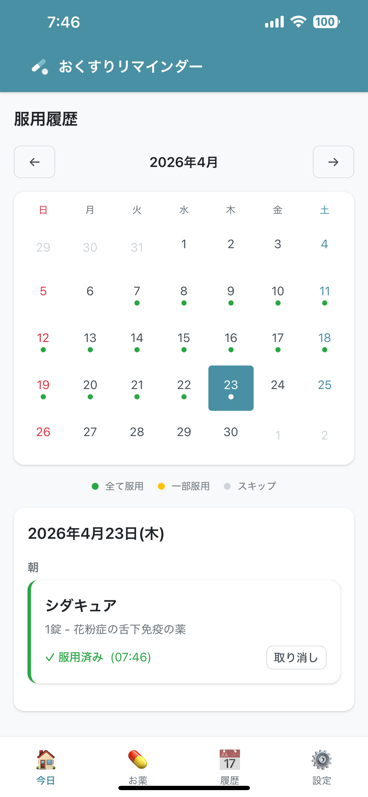
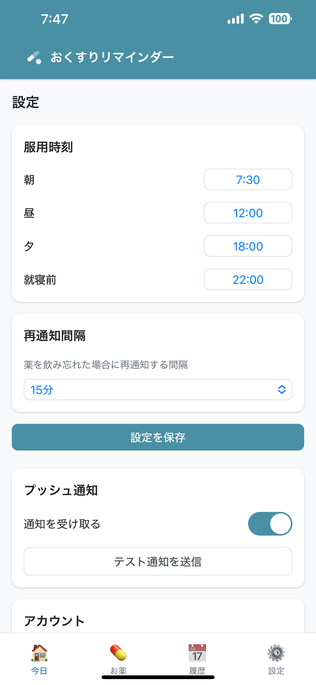

<p align="center">
  
</p>

<h1 align="center">おくすりリマインダー</h1>

<p align="center">
  「今日薬飲んだっけな〜？🤔」って思い出せない。月末に数を数えるとなぜか余る、そんな薬の飲み忘れを減らしたくて作った、おくすりの服用のリマインダー・服用履歴の管理ののPWAアプリです。<br/>
  時間になったらPUSH通知が届き、飲んだと記録するとカレンダーに履歴が残ります。
</p>

<p align="center">
  <a href="https://my-medicine-reminder.pages.dev"></a>
  <a href="./LICENSE"></a>
  <a href="https://github.com/take20m/my-medicine-reminder/releases"></a>
  
  
  
</p>

---

## スクリーンショット

<table align="center">
  <tr>
    <td align="center" valign="top">
      
    </td>
    <td align="center" valign="top">
      
    </td>
    <td align="center" valign="top">
      
    </td>
    <td align="center" valign="top">
      
    </td>
    <td align="center" valign="top">
      
    </td>
  </tr>
</table>

## 目次

- [できること](#できること)
- [技術スタック](#技術スタック)
- [アーキテクチャ](#アーキテクチャ)
- [セットアップ](#セットアップ)
- [デプロイ](#デプロイ)
- [iPhone で使う](#iphone-で使う)
- [API](#api)
- [ディレクトリ構成](#ディレクトリ構成)
- [バージョニング](#バージョニング)
- [ライセンス](#ライセンス)

## できること

- 複数のお薬を登録して、有効/無効で一時停止もできる
- 朝・昼・夕・就寝前の 4 タイミング、時刻はユーザーごとに変えられる
- 定時に Web Push でリマインド。飲み忘れたら設定した間隔で再通知
- 飲んだと記録すれば、その時刻の残り通知は自動で閉じる
- 月ごとのカレンダーで、taken / skipped / 未記録を色分け表示
- Google ログインで家族それぞれが別々に記録を持てる
- iOS / Android のホーム画面に追加できる PWA。オフラインでも履歴は見られる
- 日付の境界は JST (Asia/Tokyo) で固定

## 技術スタック

| レイヤー       | 採用技術                                       |
| -------------- | ---------------------------------------------- |
| フロント       | Preact + Vite + TypeScript                     |
| PWA / 通知表示 | Service Worker + Workbox                       |
| API            | Cloudflare Workers + [Hono](https://hono.dev/) |
| データストア   | Cloudflare KV                                  |
| 認証           | Firebase Authentication (Google)               |
| プッシュ通知   | Web Push (VAPID) ※自前実装                     |
| スケジューラー | Cloudflare Cron Triggers（5 分間隔）           |
| ホスティング   | Cloudflare Pages                               |

## セットアップ

### 前提

- Node.js 18 以上
- Cloudflare アカウント
- Firebase プロジェクト

### 1. Firebase

1. [Firebase Console](https://console.firebase.google.com/) でプロジェクトを作成
2. Authentication を有効化して Google 認証を追加
3. Web アプリを追加し、設定値を控える

### 2. Cloudflare

1. [Cloudflare Dashboard](https://dash.cloudflare.com/) で KV Namespace を作成
2. `workers/wrangler.toml` の KV ID を差し替える

### 3. VAPID 鍵を作る

```bash
cd workers
npx web-push generate-vapid-keys
```

### 4. 環境変数

```bash
cd frontend && cp .env.example .env             # Firebase の値を書き込む
cd ../workers && cp .dev.vars.example .dev.vars # VAPID / Firebase の値を書き込む
```

本番は Cloudflare Dashboard → Workers → Settings → Variables で登録。

### 5. 依存関係

```bash
cd frontend && npm install
cd ../workers && npm install
```

### 6. 起動

```bash
# ターミナル1
cd workers && npm run dev

# ターミナル2
cd frontend && npm run dev
```

<http://localhost:5173> を開く。

## デプロイ

### Workers

```bash
cd workers
npm run deploy
```

### フロントエンド (Cloudflare Pages)

1. GitHub に push
2. Cloudflare Pages で GitHub リポジトリを接続
3. ビルド設定
   - ビルドコマンド: `cd frontend && npm install && npm run build`
   - 出力ディレクトリ: `frontend/dist`
4. `VITE_FIREBASE_*` などの環境変数を Pages に登録

## iPhone で使う

1. Safari で開く
2. 共有ボタン → 「ホーム画面に追加」
3. 起動して Google でログイン
4. 設定画面で通知を有効化

Web Push は iOS 16.4 以降が必要。

## API

すべて認証必須（`Authorization: Bearer <Firebase ID Token>`）。

| メソッド | パス                            | 説明                                                 |
| -------- | ------------------------------- | ---------------------------------------------------- |
| `POST`   | `/api/auth/verify`              | Firebase トークン検証                                |
| `GET`    | `/api/medications`              | 薬一覧取得                                           |
| `POST`   | `/api/medications`              | 薬登録                                               |
| `PUT`    | `/api/medications/:id`          | 薬更新                                               |
| `DELETE` | `/api/medications/:id`          | 薬削除                                               |
| `GET`    | `/api/settings`                 | ユーザー設定取得                                     |
| `PUT`    | `/api/settings`                 | ユーザー設定更新                                     |
| `GET`    | `/api/records/:date`            | 日別記録取得                                         |
| `GET`    | `/api/records?from=&to=`        | 期間指定記録取得                                     |
| `POST`   | `/api/records`                  | 服用記録登録                                         |
| `GET`    | `/api/push/vapid-key`           | VAPID 公開鍵取得                                     |
| `POST`   | `/api/push/subscribe`           | WebPush 購読登録                                     |
| `DELETE` | `/api/push/subscribe`           | WebPush 購読解除                                     |
| `POST`   | `/api/push/test`                | テスト通知送信                                       |
| `POST`   | `/api/admin/migrate-records-tz` | UTC ずれ記録を JST キーへ移行（`?dryRun=true` 対応） |

## ディレクトリ構成

```
my-medicine-reminder/
├── frontend/                       # Preact + Vite (PWA)
│   ├── public/                     # アイコン、manifest
│   └── src/
│       ├── components/             # UI コンポーネント
│       ├── hooks/                  # カスタムフック
│       ├── pages/                  # 画面
│       ├── services/               # API / Firebase クライアント
│       ├── styles/                 # グローバル CSS
│       ├── types/                  # TypeScript 型定義
│       ├── utils/                  # 日付ユーティリティなど
│       ├── App.tsx
│       ├── main.tsx
│       └── sw.ts                   # Service Worker 本体
├── workers/                        # Cloudflare Workers (Hono)
│   └── src/
│       ├── routes/                 # /api/* のルート
│       ├── services/               # scheduler などのビジネスロジック
│       ├── utils/                  # auth / kv / date / webpush
│       ├── index.ts                # エントリポイント
│       └── types.ts
├── images/                         # README 用スクリーンショット
├── LICENSE
└── README.md
```

## バージョニング

Semver で運用しています。各リリースは
[GitHub Releases](https://github.com/take20m/my-medicine-reminder/releases)
に。

## ライセンス

MIT License。[LICENSE](./LICENSE) を参照。
